# Sepsis Early Warning System - Architecture Diagram

The following diagram provides a detailed, modular overview of the data pipeline, feature engineering logic, machine learning lifecycle, and evaluation process.

```mermaid
flowchart LR
    %% Styling
    classDef rawData fill:#e2e8f0,stroke:#64748b,stroke-width:2px,color:#0f172a
    classDef etl fill:#dbeafe,stroke:#3b82f6,stroke-width:2px,color:#1e3a8a
    classDef model fill:#dcfce7,stroke:#22c55e,stroke-width:2px,color:#14532d
    classDef eval fill:#fef3c7,stroke:#f59e0b,stroke-width:2px,color:#78350f
    classDef output fill:#f3e8ff,stroke:#a855f7,stroke-width:2px,color:#581c87

    %% Stage 1: Ingestion
    subgraph Stage1 [1. Ingestion & EDA]
        A1[(input/\nPhysioNet 2019)]:::rawData
        B1[01_eda.py\nRaw Data Loader]:::etl
        C1[07_onset_window_diagnostic.py\nOnset Runway Analysis]:::etl
        D1[08_eligibility_tagging.py\nCohort Stratification]:::etl

        A1 -->|Read .psv files| B1
        B1 --> C1
        B1 --> D1
    end

    %% Stage 2: Feature Engineering
    subgraph Stage2 [2. Feature Engineering & Split]
        A2[02_features_split.py\nTransformations]:::etl
        B2[02b_features_fast.py\nVectorized Fast Path]:::etl
        C2(Missingness Indicators):::etl
        D2(Forward Fill Vitals):::etl
        E2(6-Hour Rolling Windows):::etl
        F2[GroupShuffleSplit\nPatient-Level Isolation]:::etl

        A2 --> C2
        B2 --> C2
        C2 --> D2
        D2 --> E2
        E2 --> F2
    end

    D1 --> A2
    D1 --> B2

    %% Stage 3: Modeling
    subgraph Stage3 [3. Machine Learning]
        A3[03_baselines.py\nLogistic Reg & qSOFA]:::model
        B3[04_xgboost_main.py\nXGBoost Classifier]:::model
        C3(scale_pos_weight\nImbalance Handling):::model
        D3(Early Stop on AUCPR\nPrecision-Recall):::model

        B3 --> C3
        C3 --> D3
    end

    F2 -->|Train/Val Split| A3
    F2 -->|Train/Val Split| B3

    %% Stage 4: Evaluation
    subgraph Stage4 [4. Clinical Utility & Evaluation]
        A4[06_threshold_leadtime.py\nThreshold Sweep]:::eval
        B4[09_stratified_evaluation.py\nBy Eligibility Group]:::eval
        C4[10_hospital_subgroup.py\nHospital A vs B]:::eval
        D4[11_error_analysis.py\nQualitative Traces]:::eval
        E4[05_utility_eval_prep.py\nPhysioNet Scorer Prep]:::eval
    end

    D3 -->|Probabilities| A4
    D3 -->|Probabilities| B4
    D3 -->|Probabilities| C4
    D3 -->|Probabilities| D4
    D3 -->|Probabilities| E4

    %% Stage 5: Artifact Orchestration
    subgraph Stage5 [5. Artifact Orchestration]
        A5[12_build_artifacts.py\nMaster Pipeline]:::output
        B5[(artifacts/\nJoblib, JSON, CSV)]:::output
        C5[build_notebook.py\nNotebook Generator]:::output
        D5(sepsis_early_warning.ipynb\nFinal Analysis Report):::output

        A5 -->|Save State| B5
        B5 -->|Instant Load| C5
        C5 --> D5
    end

    B1 -.->|Full Run| A5
    F2 -.->|Full Run| A5
    D3 -.->|Full Run| A5
    A4 -.->|Full Run| A5
```

