# 📊 Data Flow & Decision-Making Architecture (Visual Cell-Annotated)

This document maps out the complete end-to-end data pipeline and decision gates for the Early Sepsis Warning project. Every architectural block is explicitly annotated with its **exact visual notebook heading** (e.g., **Cell 2.2b**, **Cell 4.6**, **Cell 5.3**) following your notebook's exact structure.

---

## 1. System Execution Pipeline & Visual Cell Routing

The notebook is architected with a dual-execution path controlled by **Cell 2.2b (`FORCE_RETRAIN`)**. This guarantees instant presentation execution (~60 seconds) while preserving full technical training capability (~7 minutes).

```mermaid
graph TD
    A["📂 Raw Dataset Directories<br/>Cell 2.3: Auto-detect paths (training_setA / setB)<br/>Cell 2.4: Load 40,336 patients (~1.5M hourly rows)"] --> B{"⚖️ Cell 2.2b: Run Control Gate<br/>Check FORCE_RETRAIN & Artifact Existence"}
    
    B -->|FORCE_RETRAIN = False<br/>& All Files Present| C["⚡ Fast-Load Mode (~60 seconds)<br/>Cell 3.0 (Centralized Loader): imports pre-trained<br/>.joblib models & predictions.csv instantly"]
    B -->|FORCE_RETRAIN = True<br/>or Missing Files| D["🔁 Full Training Pipeline (~7 minutes)<br/>Execute active machine learning training"]
    
    subgraph Core Preprocessing & Feature Extraction Pipeline
        D --> E["🧹 Preprocessing & Imputation<br/>Cell 4.2: Tag patient eligibility groups<br/>Cell 4.3: Create binary lab missingness flags<br/>Cell 4.4: Forward-fill vital history per patient<br/>Cell 4.5: Median fill start-of-stay NaNs"]
        E --> F["⏱️ 6-Hour Sliding Window Engineering<br/>Cell 4.6: build_windowed_features() computes rolling<br/>means, linear regression slopes & lab miss rates"]
        F --> G["🔒 Leakage-Free Patient-Level Split<br/>Cell 4.8: GroupShuffleSplit (70% Train | 10% Val | 20% Test)<br/>Cell 4.9: Assert 0 overlapping patients across splits"]
    end
    
    subgraph Model Training & Tuning Pipeline
        G --> H["🤖 Model Training & Hyperparameter Tuning<br/>Cell 5.1: Evaluate qSOFA clinical baseline<br/>Cell 5.2: Train ElasticNet Logistic Regression<br/>Cell 5.3: XGBoost training + 50 Optuna tuning trials<br/>Cell 5.4: LightGBM training + 50 Optuna tuning trials"]
        H --> I["🤝 Soft-Vote Ensemble Optimization<br/>Cell 5.5b: Grid search best probability weights<br/>Discovers: 45% XGB + 45% LGB + 10% LR"]
        I --> J["💾 Save Output Artifacts to Disk<br/>Cell 5.5b: Export models & CSVs to artifacts/ dir"]
    end
    
    C --> K["📈 Evaluation & Threshold Calibration"]
    J --> K
    
    subgraph Evaluation & Calibration Pipeline
        K --> L["📐 PhysioNet Utility Scorer & Threshold Sweep<br/>Cell 6.1: Define official verbatim reward function<br/>Cell 6.2: Load validation & test prediction curves<br/>Cell 6.4: Validation Sweep tests cutoffs 0.05 to 0.95<br/>Discovers Optimal Clinical Threshold: P ≥ 0.34"]
        L --> M["🏆 Test Set & Subgroup Verification<br/>Section 7: Compute final Test Utility (0.327)<br/>Stratify results across Hospital A vs Hospital B"]
        M --> N["🔬 Error Analysis & Live Code Demo<br/>Cell 8.4: Deep-dive 4 clinical case study plots<br/>Cell 10.3-10.5: Live streaming inference demo"]
    end
```

---

## 2. Visual Cell-by-Cell Detailed Execution Summary

Use this exact mapping to match your presentation points directly to the visual markdown headers in your notebook:

### ⚙️ Section 2: Setup and Exploratory Data Analysis (EDA)
* **Title Slide (Section 0)**: Displays project metadata, team members, matriculation numbers, and deadline.
* **Cell 2.1 (Dependencies)**: Executes a single quiet `pip install` for `xgboost`, `lightgbm`, `optuna`, `joblib`, etc.
* **Cell 2.2 (Imports)**: Imports essential Python libraries (`pandas`, `numpy`, `scikit-learn`, `matplotlib`, `os`, `json`).
* **Cell 2.2b (Run Control Gate)**: Defines `FORCE_RETRAIN = False`. Checks if all 8 artifact files exist in `artifacts/`. Sets `should_train`.
* **Centralized Artifact Loader (Cell 3.0)**: If `should_train = False`, pre-loads feature columns, models, validation/test predictions, and optimal threshold into memory instantly.
* **Cell 2.3 (`load_all_patients`)**: Scans directories for `.psv` files, extracts patient IDs from file names, attaches hospital tags (`A` or `B`), and concatenates them into one DataFrame.
* **Cell 2.4**: Calls `load_all_patients()`. Prints summary stats: **40,336 patients**, **1,552,210 rows**, overall sepsis rate **1.8%**.
* **Cells 2.5, 2.6, 2.7 (EDA Plots)**: Generates the label distribution pie chart (`label_distribution.png`), the lab missingness bar chart (`missingness.png`), and sample vital trajectory plots.

### 🧹 Section 4: Clinical Preprocessing & Feature Engineering
* **Cell 4.1**: Lists feature arrays: `VITALS` (8 columns), `LABS` (26 columns), `DEMOGRAPHICS` (6 columns).
* **Cell 4.2 (Eligibility Tagging)**: Classifies patients into `never_septic`, `early_warning_eligible` (sepsis onset ≥ hour 7), and `immediate_only` (sepsis onset within first 6 hours).
* **Cell 4.3 (Missingness Indicators)**: Creates binary flags (`1` if lab measured, `0` if NaN) to capture doctor test-ordering frequency.
* **Cell 4.4 (Forward Fill)**: Carries each patient's last measured vital sign forward hour-by-hour.
* **Cell 4.5 (Median Fill)**: Imputes remaining start-of-stay NaNs using population median.
* **Cell 4.6 (`build_windowed_features`)**: For every hour $T \ge 6$, slices the past 6 hours. Computes `_last`, rolling 6h `_mean`, linear fit `_slope`, and lab `_miss_rate`. Drops hours 1–5 per patient.
* **Cell 4.7**: Attaches eligibility group labels to the processed feature table.
* **Cell 4.8 (`patient_level_split`)**: Uses `GroupShuffleSplit` on unique `patient_id`s to divide data into **Train (70%)**, **Validation (10%)**, and **Test (20%)**.
* **Cell 4.9 (Leakage Assertion)**: Runs automated Python `assert` verifying intersections between train/val/test patient sets equal `0`.

### 🤖 Section 5 & 6: Modeling and Threshold Calibration
* **Cell 5.1 (qSOFA Baseline)**: Computes clinical baseline score ($+1$ if Resp $> 22$, $+1$ if SBP $< 100$). Validation Utility: `0.005`.
* **Cell 5.2 (Logistic Regression)**: Trains ElasticNet regularized model. Saves `lr_model.joblib`.
* **Cell 5.3 (XGBoost + Optuna)**: Optimizes tree depth, learning rate, and child weight over 50 trials using `scale_pos_weight` to handle imbalance. Saves `xgb_model.joblib`.
* **Cell 5.4 (LightGBM + Optuna)**: Runs 50 tuning trials for LightGBM. Saves `lgb_model.joblib`.
* **Cell 5.5b (Soft-Vote Ensemble)**: Performs grid search over probability weights. Discovers optimal mix: **0.45 XGB + 0.45 LGB + 0.10 LR**. Saves `ensemble_weights.joblib`.
* **Cell 5.6**: Plots Top 15 Feature Importances from XGBoost.
* **Cell 6.1 (PhysioNet Utility Scorer)**: Verbatim official function awarding $+1.0$ for alarms 12h–6h prior, grading down to $0.0$ for late alarms, and penalizing false alarms $-0.05$.
* **Cell 6.2**: Loads saved predictions and ensemble weights in fast-load mode.
* **Cell 6.3**: Plots the official PhysioNet reward/penalty timeline curve.
* **Cell 6.4 (Threshold Sweep)**: Evaluates decision cutoffs from `0.05` to `0.95` on Validation set. Proves default `0.50` fails (Utility `0.08`) and discovers peak clinical cutoff at **`0.34`** (Utility `0.341`).
* **Cells 6.5 & 6.6**: Displays per-model utility comparison tables and overlays validation sweep curves.

### 🏆 Section 7, 8, 9 & 10: Evaluation, Error Analysis & Live Demo
* **Section 7 (Test Evaluation)**: Evaluates ensemble on unseen Test set at `0.34` cutoff. Official Test Utility: **`0.327`** (60x higher than qSOFA). Outputs hospital subgroup table.
* **Cells 8.1–8.4 (Error Case Studies)**: Plots 4 distinct patient trajectories: Success (early alert), Miss (blunted fever), False Alarm (chronic hypertension), and Structural Limit (patient arrives septic on Hour 1).
* **Cell 9.1 (Conclusion Table)**: Summarizes primary findings answering research question without recomputing.
* **Cells 10.1–10.5 (Live Demo)**: Loads saved models fresh. Streams an unseen test patient's hourly vital signs. Shows ensemble probability climbing across `0.34` threshold at Hour 18, triggering a live alert **6 hours early**.
