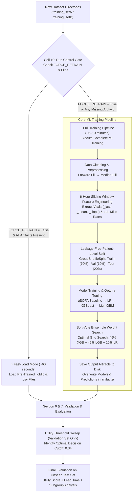
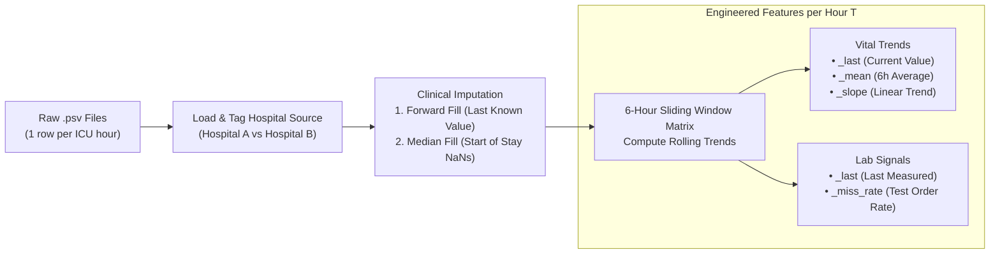
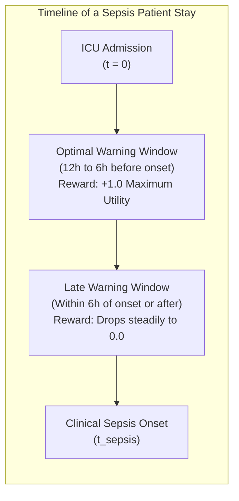
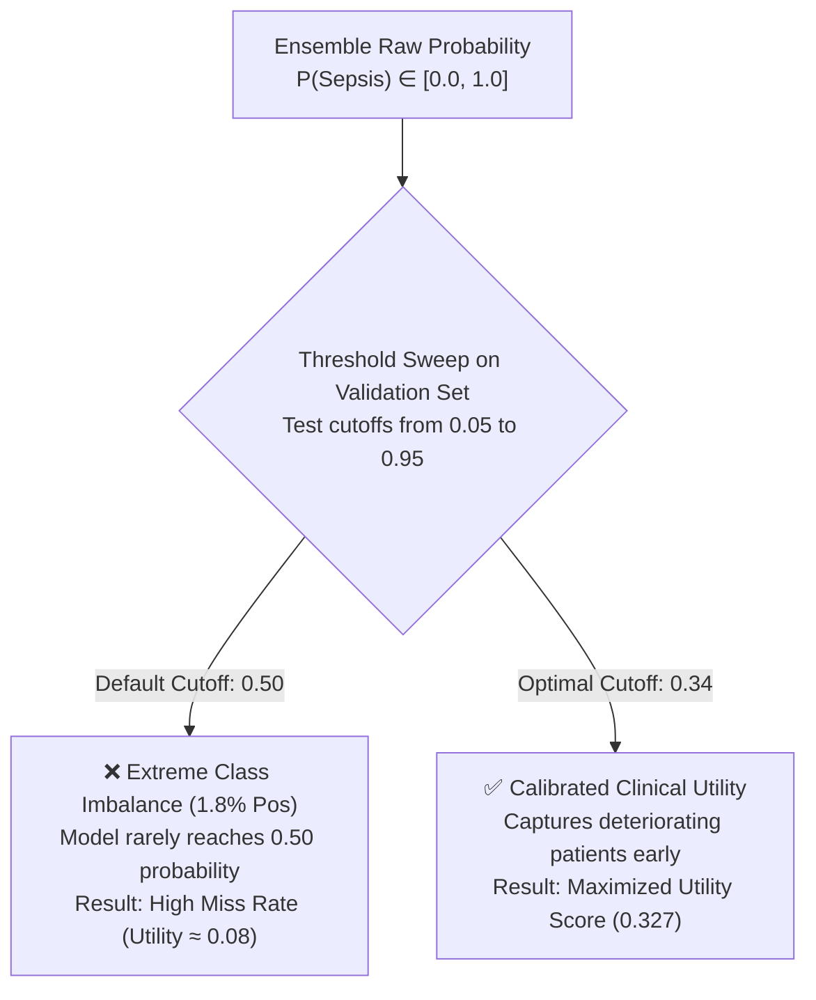

# 📊 Data Flow & Decision-Making Architecture

This document maps out the complete end-to-end data pipeline and decision gates for the Early Sepsis Warning project. Use these visual flows to explain your methodology clearly to judges or in technical documentation.

---

## 1. System Execution Pipeline & Run Control Routing

The notebook is architected with a dual-execution path controlled by Cell 10 (`FORCE_RETRAIN`) and automatic file validation. This guarantees live demonstration smoothness while maintaining full technical reproducibility.

---

## 2. Preprocessing & Feature Engineering Flow

How raw hospital measurements transform into actionable predictive features:

### Key Preprocessing Decisions
* **Why Forward-Fill?** In an ICU setting, physiological variables do not change instantly. Carrying the last measured heart rate or blood pressure forward reflects the true clinical assumption until a new measurement is taken.
* **Why Missingness Rates?** Lab tests (like Lactate or Blood Cultures) are not ordered randomly. A sudden cluster of lab orders indicates doctor concern. By calculating the 6-hour missingness rate (`_miss_rate`), the AI learns to treat the *presence or absence of a test* as a diagnostic signal.
* **Why Slopes?** A patient with a static Heart Rate of 95 bpm is stable. A patient whose Heart Rate rose from 70 to 95 over the last 6 hours (`positive slope`) is actively deteriorating. Slopes capture momentum before static thresholds break.

---

## 3. Clinical Utility Decision Matrix (PhysioNet Challenge 2019)

Standard Machine Learning metrics (Accuracy, F1-Score) treat all errors equally. In medical monitoring, a late warning is fatal, and excessive false alarms cause doctor burnout. We evaluate models using the official clinical utility reward function:

### The Reward / Penalty Rulebook
| Clinical Scenario | System Action | Utility Reward / Penalty | Interpretation |
|---|---|---|---|
| **Early True Positive** | Alarm sounds **6 to 12 hours before** sepsis onset | **+1.00** (Maximum Reward) | Provides doctors enough lead time to administer fluids and intravenous antibiotics safely. |
| **Late True Positive** | Alarm sounds **within 6 hours** of onset or after | **+0.80 down to 0.00** | Better than nothing, but clinical efficacy drops rapidly as organ damage begins. |
| **False Negative (Miss)**| Patient develops sepsis, but **no alarm** sounds | **0.00** (No Reward) | Failed to protect the patient. |
| **False Positive (False Alarm)**| Patient never develops sepsis, but **alarm sounds** | **-0.05** (Active Penalty) | Contributes to "alarm fatigue," causing staff to ignore future monitor alerts. |
| **True Negative** | Stable patient, **no alarm** sounds | **0.00** (Neutral) | Correct baseline system behavior. |

---

## 4. Threshold Calibration Gate

Why we do not use the default Machine Learning probability cutoff of `0.50`:

