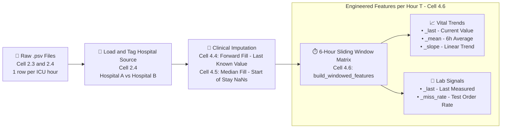
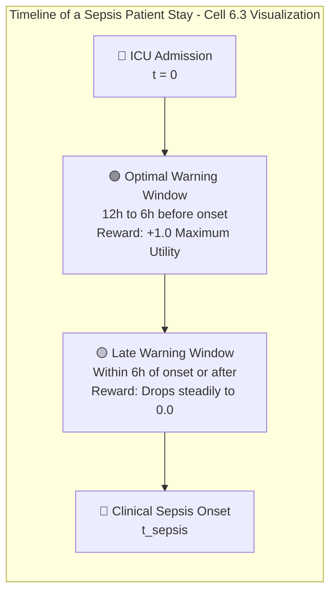
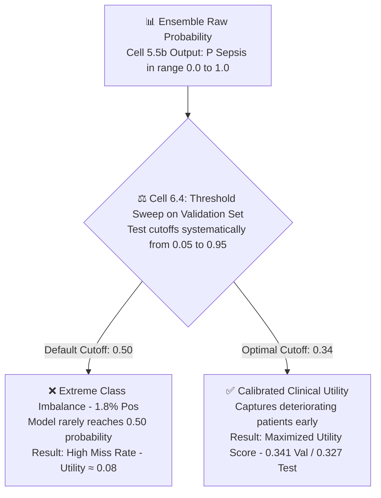

# 📊 Data Flow & Decision-Making Architecture (Visual Cell-Annotated)

This document maps out the complete end-to-end data pipeline and decision gates for the Early Sepsis Warning project. Every single architectural block across all four diagrams is explicitly annotated with its **exact visual notebook heading** (e.g., **Cell 2.2b**, **Cell 4.6**, **Cell 5.3**, **Cell 6.4**) following your notebook's exact structure.

---

## 1. System Execution Pipeline & Visual Cell Routing

The notebook is architected with a dual-execution path controlled by **Cell 2.2b (`FORCE_RETRAIN`)**. This horizontal layout gives you an immediate, single-screen overview of the entire system routing while preserving rich technical details:

```mermaid
graph LR
    A["📂 Raw Dataset Directories<br/>Cell 2.3: Auto-detect folders<br/>Cell 2.4: Load 40,336 patients"] --> B{"⚖️ Cell 2.2b Run Gate<br/>Check FORCE_RETRAIN<br/>and Artifacts"}
    
    B -->|False: Fast Mode| C["⚡ Fast-Load Mode ~60s<br/>Cell 3.0 Central Loader:<br/>Load saved .joblib models"]
    B -->|True: Train Mode| D["🔁 Full Training Pipeline ~7m<br/>Execute ML model training"]
    
    subgraph Preprocessing [🧹 Preprocessing and Feature Engineering - Section 4]
        D --> E["Cell 4.2 to 4.5 Imputation<br/>Forward-fill vitals and<br/>Median-fill start NaNs"] --> F["Cell 4.6 Feature Windows<br/>build_windowed_features:<br/>6h Means, Slopes, Miss Rates"] --> G["Cell 4.8 Patient Split<br/>GroupShuffleSplit:<br/>70% Train | 10% Val | 20% Test"]
    end
    
    subgraph Modeling [🤖 Model Training and Ensemble - Section 5]
        G --> H["Cell 5.1 to 5.4 Training<br/>qSOFA Baseline, ElasticNet LR,<br/>XGBoost and LightGBM Optuna"] --> I["Cell 5.5b Ensemble Optimization<br/>Soft-Vote Grid Search Discovers:<br/>45% XGB + 45% LGB + 10% LR"] --> J["💾 Export Saved Artifacts<br/>Cell 5.5b: Save models and<br/>predictions to artifacts/"]
    end
    
    C --> K["📈 Clinical Utility Evaluation"]
    J --> K
    
    subgraph Evaluation [🏆 Evaluation and Calibration - Section 6 to 10]
        K --> L["Cell 6.4 Threshold Sweep<br/>Test cutoffs 0.05 to 0.95<br/>Discovers Peak Cutoff P ≥ 0.34"] --> M["Section 7 Test Evaluation<br/>Final Unseen Test Utility: 0.327<br/>60x Higher than qSOFA"] --> N["Cell 10.3 to 10.5 Live Demo<br/>Stream real patient vital history<br/>Trigger alarm 6 hours early"]
    end
```

---

## 2. Preprocessing & Feature Engineering Flow (Annotated)

How raw hospital measurements transform into actionable predictive features inside **Section 4**:

### Key Preprocessing Decisions
* **Why Forward-Fill (Cell 4.4)?** In an ICU setting, physiological variables do not change instantly. Carrying the last measured heart rate or blood pressure forward reflects the true clinical assumption until a new measurement is taken.
* **Why Missingness Rates (Cell 4.3 & 4.6)?** Lab tests (like Lactate or Blood Cultures) are not ordered randomly. A sudden cluster of lab orders indicates doctor concern. By calculating the 6-hour missingness rate (`_miss_rate`), the AI learns to treat the *presence or absence of a test* as a diagnostic signal.
* **Why Slopes (Cell 4.6)?** A patient with a static Heart Rate of 95 bpm is stable. A patient whose Heart Rate rose from 70 to 95 over the last 6 hours (`positive slope`) is actively deteriorating. Slopes capture momentum before static thresholds break.

---

## 3. Clinical Utility Decision Matrix (Cell 6.1 & 6.3)

Standard Machine Learning metrics (Accuracy, F1-Score) treat all errors equally. In medical monitoring, a late warning is fatal, and excessive false alarms cause doctor burnout. We evaluate models using the official clinical utility reward function embedded in **Cell 6.1**:

### The Reward / Penalty Rulebook (Cell 6.1 Logic)
| Clinical Scenario | System Action | Utility Reward / Penalty | Interpretation |
|---|---|---|---|
| **Early True Positive** | Alarm sounds **6 to 12 hours before** sepsis onset | **+1.00** (Maximum Reward) | Provides doctors enough lead time to administer fluids and intravenous antibiotics safely. |
| **Late True Positive** | Alarm sounds **within 6 hours** of onset or after | **+0.80 down to 0.00** | Better than nothing, but clinical efficacy drops rapidly as organ damage begins. |
| **False Negative (Miss)**| Patient develops sepsis, but **no alarm** sounds | **0.00** (No Reward) | Failed to protect the patient. |
| **False Positive (False Alarm)**| Patient never develops sepsis, but **-0.05** (Active Penalty) | Contributes to "alarm fatigue," causing staff to ignore future monitor alerts. |
| **True Negative** | Stable patient, **no alarm** sounds | **0.00** (Neutral) | Correct baseline system behavior. |

---

## 4. Threshold Calibration Gate (Cell 6.4)

Why we do not use the default Machine Learning probability cutoff of `0.50` in **Cell 6.4**:

---

## 5. Visual Cell-by-Cell Detailed Execution Summary

Use this exact mapping to match your presentation points directly to the visual markdown headers in your notebook:

### ⚙️ Section 2: Setup and Exploratory Data Analysis (EDA)
* **Title Slide (Section 0)**: Displays project metadata, team members, matriculation numbers, and deadline.
* **Cell 2.1 (Dependencies)**: Executes a single quiet `pip install` for `xgboost`, `lightgbm`, `optuna`, `joblib`, etc.
* **Cell 2.2 (Imports)**: Imports essential Python libraries (`pandas`, `numpy`, `scikit-learn`, `matplotlib`, `os`, `json`).
* **Cell 2.2b (Run Control Gate)**: Defines `FORCE_RETRAIN = False`. Checks if all 8 artifact files exist in `artifacts/`. Sets `should_train`.
* **Centralized Artifact Loader (Cell 3.0)**: If `should_train = False`, pre-loads feature columns, models, validation/test predictions, and optimal threshold into memory instantly.
* **Cell 2.3 (`load_all_patients`)**: Scans directories for `.psv` files, extracts patient IDs from file names, attaches hospital tags (`A` or `B`), and concatenates them into one DataFrame.
* **Cell 2.4**: Calls `load_all_patients()`. Prints summary stats: **40,336 patients**, **1,552,210 rows**, overall sepsis rate **1.8%**.
* **Cells 2.5, 2.6, 2.7 (EDA Plots)**: Generates the label distribution pie chart (`label_distribution.png`), the lab missingness bar chart (`missingness.png`), and sample vital trajectory plots.

### 🧹 Section 4: Clinical Preprocessing & Feature Engineering
* **Cell 4.1**: Lists feature arrays: `VITALS` (8 columns), `LABS` (26 columns), `DEMOGRAPHICS` (6 columns).
* **Cell 4.2 (Eligibility Tagging)**: Classifies patients into `never_septic`, `early_warning_eligible` (sepsis onset ≥ hour 7), and `immediate_only` (sepsis onset within first 6 hours).
* **Cell 4.3 (Missingness Indicators)**: Creates binary flags (`1` if lab measured, `0` if NaN) to capture doctor test-ordering frequency.
* **Cell 4.4 (Forward Fill)**: Carries each patient's last measured vital sign forward hour-by-hour.
* **Cell 4.5 (Median Fill)**: Imputes remaining start-of-stay NaNs using population median.
* **Cell 4.6 (`build_windowed_features`)**: For every hour $T \ge 6$, slices the past 6 hours. Computes `_last`, rolling 6h `_mean`, linear fit `_slope`, and lab `_miss_rate`. Drops hours 1–5 per patient.
* **Cell 4.7**: Attaches eligibility group labels to the processed feature table.
* **Cell 4.8 (`patient_level_split`)**: Uses `GroupShuffleSplit` on unique `patient_id`s to divide data into **Train (70%)**, **Validation (10%)**, and **Test (20%)**.
* **Cell 4.9 (Leakage Assertion)**: Runs automated Python `assert` verifying intersections between train/val/test patient sets equal `0`.

### 🤖 Section 5 & 6: Modeling and Threshold Calibration
* **Cell 5.1 (qSOFA Baseline)**: Computes clinical baseline score ($+1$ if Resp $> 22$, $+1$ if SBP $< 100$). Validation Utility: `0.005`.
* **Cell 5.2 (Logistic Regression)**: Trains ElasticNet regularized model. Saves `lr_model.joblib`.
* **Cell 5.3 (XGBoost + Optuna)**: Optimizes tree depth, learning rate, and child weight over 50 trials using `scale_pos_weight` to handle imbalance. Saves `xgb_model.joblib`.
* **Cell 5.4 (LightGBM + Optuna)**: Runs 50 tuning trials for LightGBM. Saves `lgb_model.joblib`.
* **Cell 5.5b (Soft-Vote Ensemble)**: Performs grid search over probability weights. Discovers optimal mix: **0.45 XGB + 0.45 LGB + 0.10 LR**. Saves `ensemble_weights.joblib`.
* **Cell 5.6**: Plots Top 15 Feature Importances from XGBoost.
* **Cell 6.1 (PhysioNet Utility Scorer)**: Verbatim official function awarding $+1.0$ for alarms 12h–6h prior, grading down to $0.0$ for late alarms, and penalizing false alarms $-0.05$.
* **Cell 6.2**: Loads saved predictions and ensemble weights in fast-load mode.
* **Cell 6.3**: Plots the official PhysioNet reward/penalty timeline curve.
* **Cell 6.4 (Threshold Sweep)**: Evaluates decision cutoffs from `0.05` to `0.95` on Validation set. Proves default `0.50` fails (Utility `0.08`) and discovers peak clinical cutoff at **`0.34`** (Utility `0.341`).
* **Cells 6.5 & 6.6**: Displays per-model utility comparison tables and overlays validation sweep curves.

### 🏆 Section 7, 8, 9 & 10: Evaluation, Error Analysis & Live Demo
* **Section 7 (Test Evaluation)**: Evaluates ensemble on unseen Test set at `0.34` cutoff. Official Test Utility: **`0.327`** (60x higher than qSOFA). Outputs hospital subgroup table.
* **Cells 8.1–8.4 (Error Case Studies)**: Plots 4 distinct patient trajectories: Success (early alert), Miss (blunted fever), False Alarm (chronic hypertension), and Structural Limit (patient arrives septic on Hour 1).
* **Cell 9.1 (Conclusion Table)**: Summarizes primary findings answering research question without recomputing.
* **Cells 10.1–10.5 (Live Demo)**: Loads saved models fresh. Streams an unseen test patient's hourly vital signs. Shows ensemble probability climbing across `0.34` threshold at Hour 18, triggering a live alert **6 hours early**.

---

## 6. Project Dependencies & Technical Roles

Installed via **Cell 2.1** and imported in **Cell 2.2**, each package plays a vital, specialized role in executing the clinical pipeline:

| Library / Package | General Description | Specific Role & Usage in Our Codebase |
|---|---|---|
| **`pandas`** | The fundamental Python library for structured data manipulation and analysis. It provides high-performance tabular data structures (`DataFrame` and `Series`) with powerful indexing, merging, grouping, and time-series aggregation tools. | Used extensively in **Cell 2.3 & 2.4** to read and concatenate over 40,000 pipe-separated (`.psv`) files into a master dataset; in **Cell 4.4 & 4.5** to perform patient `groupby` forward-filling and start-of-stay median imputation; and in **Cell 4.6** to slice vectorized 6-hour sliding windows. |
| **`numpy`** | The foundational package for scientific computing in Python. It provides high-performance multidimensional array objects (`ndarray`) and mathematical algorithms for linear algebra, Fourier transforms, and polynomial equations. | Used in **Cell 4.6** to calculate linear regression polynomial slopes (`np.polyfit`) across 6-hour vital sign trajectories (measuring patient deterioration velocity), and in **Cell 4.3 & 6.1** for vectorized boolean comparisons and utility scoring calculations. |
| **`scikit-learn`** | The industry-standard Python machine learning library featuring classification, regression, clustering, preprocessing, and model evaluation modules built on top of NumPy and SciPy. | Provides `GroupShuffleSplit` in **Cell 4.8** to ensure strict patient-level separation across Train (70%), Validation (10%), and Test (20%) sets without time-series leakage; provides `LogisticRegression` with ElasticNet regularization in **Cell 5.2**; and supplies evaluation metrics (`roc_auc_score`, `average_precision_score`) in **Cell 6.5 & Section 7**. |
| **`xgboost`** | Extreme Gradient Boosting — a scalable, highly optimized decision-tree-based ensemble library utilizing gradient boosting algorithms. Renowned for dominating tabular data benchmarks due to execution speed and accuracy. | Used in **Cell 5.3** as our primary non-linear boosted classifier. We configure its `scale_pos_weight` hyperparameter to directly combat the severe 1.8% positive class imbalance, forcing decision trees to heavily penalize missed sepsis alarms. |
| **`lightgbm`** | Microsoft’s Light Gradient Boosting Machine — a fast, distributed gradient boosting framework based on decision tree algorithms that grows trees leaf-wise rather than depth-wise, drastically increasing training speed and reducing memory usage. | Used in **Cell 5.4** as the secondary tree architecture in our ensemble. Its leaf-wise splitting structure complements XGBoost by capturing subtle non-linear interaction rules between sparse laboratory test missingness flags (`_miss_rate`). |
| **`optuna`** | An open-source, automated hyperparameter optimization framework designed for machine learning. It employs Bayesian optimization (Tree-structured Parzen Estimators) and dynamic pruning to search complex parameter spaces efficiently. | Employed in **Cell 5.3 & 5.4** to automatically execute 50 tuning trials per tree model, optimizing critical hyperparameters like tree depth, learning rate, child weight, and L1/L2 regularization strictly on the validation set. |
| **`joblib`** | A specialized Python object serialization library providing lightweight pipelining and parallel processing capabilities, specifically optimized to serialize large NumPy arrays and machine learning models rapidly. | Used in **Cell 3.0, 5.2, 5.3, 5.4, & 5.5b** to save trained model objects (`.joblib`) and ensemble weights to disk, powering our **60-second Fast-Load presentation mode** so live demonstrations run instantaneously without re-training. |
| **`matplotlib` & `seaborn`** | `matplotlib` is the foundational 2D plotting library for Python, while `seaborn` is a high-level statistical visualization library built on top of `matplotlib` that produces beautiful, standardized visual charts. | Used in **Cell 2.5–2.7** to plot exploratory distributions (class imbalance pie charts and lab missingness bars); in **Cell 6.3 & 6.4** to graph the official PhysioNet reward curve and our utility threshold sweep; and in **Cell 8.4** to visualize the 4 clinical error analysis case trajectories. |
